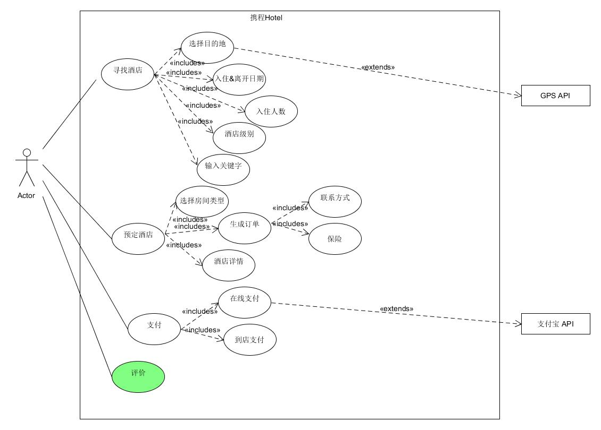
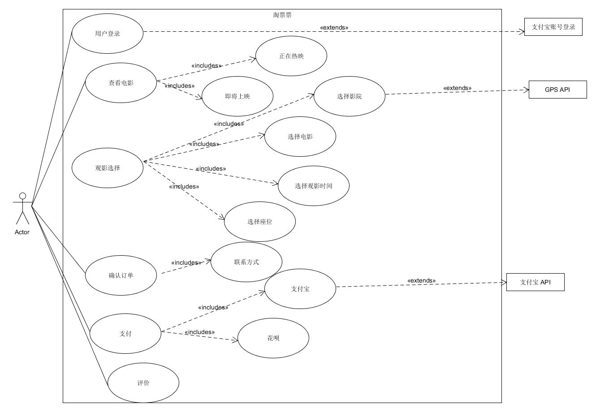

1、简答题
====
1.用例的概念

是软件工程或系统工程中对系统如何反应外界请求的描述，是一种通过用户的使用场景来获取需求的技术。 每个用例提供了一个或多个场景,该场景说明了系统是如何和最终用户或其他系统互动,也就是谁可以用系统做什么,从而获得一个明确的业务目标.

2.用例和场景的关系？什么是主场景或 happy path？
* 用例和场景：每一个用例包括了许多个场景，场景中包含了用户是如何与系统进行交互，即谁可以利用系统做什么事情。
* 主场景：这是用例最基本的组成部分，它描述了满足涉众关注点的典型成功路径。要注意的是，主场景通常不包括任何条件或分支，这是为了保持连贯性，并且将所有的条件处理都延迟到扩展部分。这种具有争议的做法更易于理解和扩展。

3.用例有哪些形式？

用例主要有三种形式：
* Brief：简洁的总结，通常是主要的成功场景，能够很快的做出。
* Casual：包含很多场景的简要的提醒性质的用例。
* Fully：完整的，包括所有步骤的，并且经可能使用例详尽的格式。 

4.对于复杂业务，为什么编制完整用例非常难？

* 用例在捕获系统功能需求上表现很优秀,但是不适合捕获非功能性需求.
* 复杂业务的子用例间依赖关系复杂,难以刻画真实世界的业务情况
* 复杂业务的需求太多,无法捕捉真实世界的全部业务情况和流程情况

5.什么是用例图？
是指由参与者（Actor）、用例（Use Case），系统边界以及它们之间的关系构成的用于描述系统功能的图。

6.用例图的基本符号与元素？

用例用椭圆表示,矩形框表示整个系统,矩形框外的小人表示系统的参与者,参与者与用例连线表示参与者与用例有交互.虚线表示include 和 extend

7.用例图的画法与步骤

* 确定系统边界,用方框表示
* 识别参与者：确定系统中的参与者（Actor），其中包括主要参与者，协作参与者，幕后参与者
* 确定主要参与者的目标,选择满足参与者目标的用例名称,画成椭圆形,椭圆形在方框之内,表示系统的内部功能
* 参与者与用例的联系用实线连接
* 确认用例间的关系，包括包含和扩展

8.用例图给利益相关人与开发者的价值有哪些？
* 利于利益相关人了解系统的功能特点和服务
* 利于开发者明确需要实现的功能。
* 在客户和软件开发者之间达成协议
* 给出了系统该做什么的一个清晰的一致的描述

2、建模练习题（用例模型）
=======
* 选择2-3个你熟悉的类似业务的在线服务系统（或移动 APP），如定旅馆（携程、去哪儿等）、定电影票、背单词APP等，分别绘制它们用例图。并满足以下要求：

  * 请使用用户的视角，描述用户目标或系统提供的服务
  * 粒度达到子用例级别，并用 include 和 exclude 关联它们
  * 请用色彩标注出你认为创新（区别于竞争对手的）用例或子用例
  * 尽可能识别外部系统和服务
  
1、

2、
* 然后，回答下列问题：

1.为什么相似系统的用例图是相似的？

在相似的系统中，用户的预期目标是一样的，不用的系统需要达到用户期望的目的是一样的。如订票系统都需要用户提供时间、地点、票的类型等。为了提供相似的服务，相似的系统之间的用例图也是相似的。

2.如果是定旅馆业务，请对比 Asg_RH 用例图，简述如何利用不同时代、不同地区产品的用例图，展现、突出创新业务和技术

* 简化用户操作流程，给用户关于预定的酒店的最直观的信息
* 通过活动吸引顾客，如不定期地提供各种优惠活动或者优惠组合，方便用户选择更好的方案。
* 满足多用户需求，如增加房型，变更提供房间的方式，这些都使得用户的选择更多，用户体验更好。

3.如何利用用例图定位创新思路（业务创新、或技术创新、或商业模式创新）在系统中的作用

对于关于不同方面的创新的用例，使用不同颜色背景的用例图表示，直观地观察其在系统中的作用。

4.请使用 SCRUM 方法，选择一个用例图，编制某定旅馆开发的需求（backlog）开发计划表

| ID | Name  | Imp |Est |How to demo |Notes|
|-   |-      |-    |-   |-           |-    |
|1   |寻找酒店 |90  |3|输入城市入住日期,退房日期,房间价格即可搜索到想要的酒店|GPS帮助定位
|2   |预定酒店 |100 |2|用户选择酒店后，可以对入住信息做进一步修改，然后确定入住者信息。|使用优秀的筛选过滤算法实现综合的排序功能。|
|3   |支付订单 |80|3|用户选择自己喜欢的方式进行支付。|良好的接口，对接外部第三方的支付平台
|4   |评价    | 80|4|用户在结束住房后在评论区写下评价，并给酒店打分。|需要有良好的评价机制和考评制度|

5.根据任务4，参考 使用用例点估算软件成本，给出项目用例点的估算

| 用例 | 事务  | 计算 |原因|UC权重 |估算|
|-   |-      |-    |-   |-     |-    |
|寻找酒店|4|2|   |简单|4|
|预定酒店|8|5 | |困难|46|
|支付订单|3|2|  |平均|12|
|评价|5|4 |  |平均| 20|
